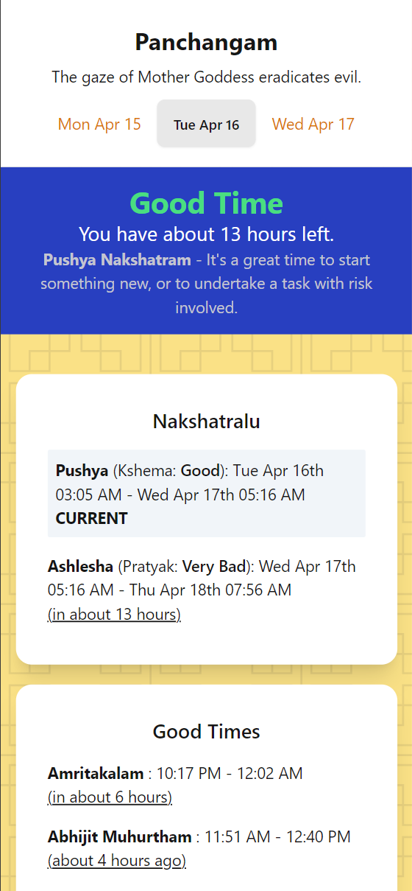

PanchangamLite ([Demo](https://panchangam.rambhat.la))
---
A Minimalist frontend incorporating Tarabalam with the current day's Panchangam.




## Features
- 🐳 Dockerized, Easy to Selfhost.
- 🌐 Retrieves information from an [authentic source](https://telugu.panchangam.org/dailypanchangam.php).
- 📄 Incorporates Tarabalam information.

## Selfhosting
```
git clone https://github.com/TheOnlyWayUp/PanchangamLite && cd PanchangamLite
docker build . -t 'panchangamlite:latest'
docker run --rm -p 80:80 -d panchangamlite:latest
```
That's it. You can access your instance at `https://localhost:80`.

## Stack
I used SvelteKit and DaisyUI for this. Short and Simple.

An interest part of this project is my implementation of BeautifulSoup-like Web-Scraping from Javascript.

<br>

<div align="center">
    <p>TheOnlyWayUp © 2023</p>
</div>